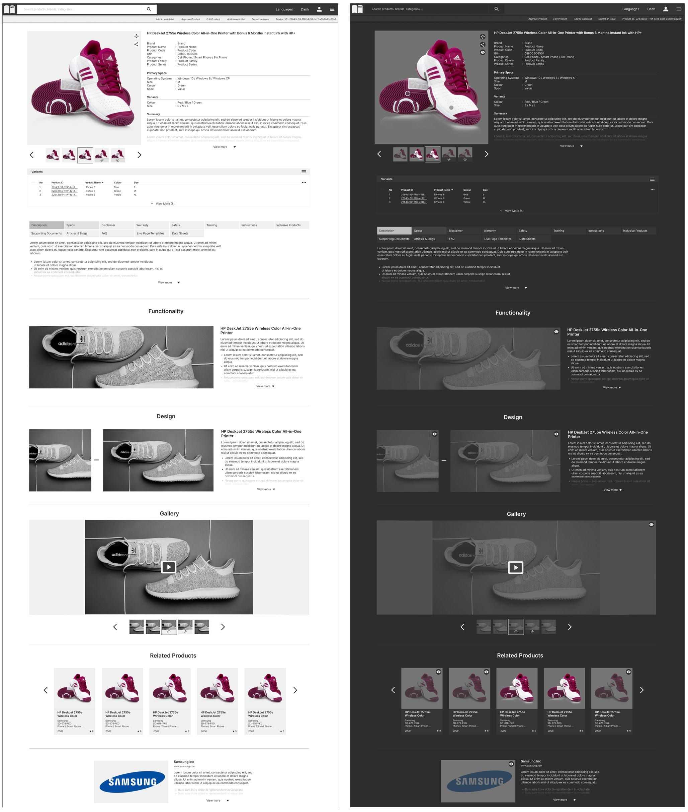

# openPIM UI
Welcome to the openPIM UI repository! This is the React user interface for the openPIM API, your collaborative product knowledge hub. The UI is designed to provide users with an intuitive and seamless experience for managing and accessing product information.

## Description
The openPIM UI is designed to complement the functionality of the openPIM API, allowing users to interact with the product knowledge hub through a visually appealing and user-friendly interface. With features such as dark mode support, community collaboration tools, and comprehensive data access, the openPIM UI empowers users to make the most of their product data.

## Features
- **Dark Mode Support**: Seamlessly switch between light and dark modes for optimal viewing comfort.
- **Community Collaboration**: Harness the power of collective knowledge with community contributions and editing.
- **Comprehensive Data Access**: Access a vast repository of product information, including marketing materials, specifications, images, and warranty details.
- **Intuitive User Interface**: Enjoy a user-friendly interface designed for ease of use and navigation.

## Theme Screenshots

*Light/Dark product viewing page example*

## Installation
1. Clone this repository.
2. Navigate to the project directory.
3. Install dependencies.
4. Start the development server.
5. Open your browser and visit `http://localhost:3000` to view the UI.

## The API
Visit [openPIM](https://openpim.io), to interact with the staged API, which includes both REST documentation and a GraphiQL playground.

## Contact
If you have any questions or feedback, feel free to contact me at [blakekellett10@gmail.com](mailto:blakekellett10@gmail.com).
